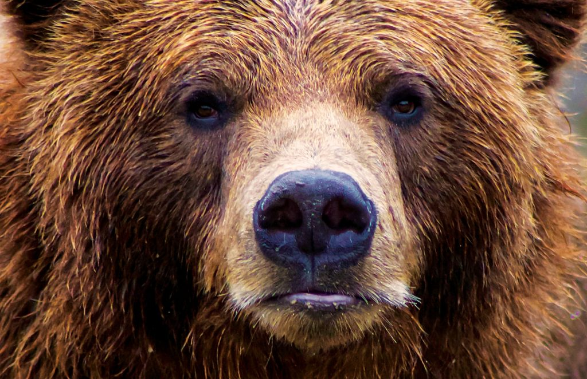

Yo I'm Kanhay. I'm a Sophmore at Del Norte High School. I am taking AP Physics, AP Calculus AB, AP Computer Science Principles, AP Seminar, World History 1-2, and Honors Principles of Engineering. I am a Cross Country runner, a Robotics Club member, a coach for Science Olympiad at Oak Valley, a coach for Science Olympiad at Del Norte, and a CyberPatriot competitor. 
<h1> I come from California. This is a California Bear </h1>
 

